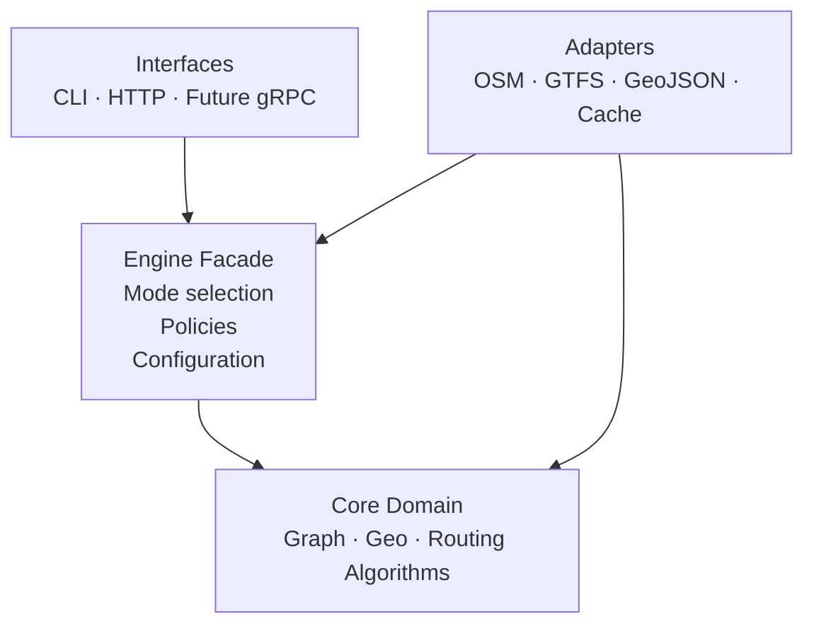

# Pathcraft – Architecture Overview

Pathcraft is a modular, multimodal routing engine written in Go.
It is designed to work as:

- a reusable **Go library (SDK)**
- a **CLI application**
- an **HTTP server (ready-to-run)**
- an **embedded engine** inside other systems

The architecture follows **Modular Monolith** 

> An initial evaluation considered a Hexagonal (Ports and Adapters) architecture. However, given
the current scope of the project and its focus on algorithmic correctness, performance, and
rapid iteration, a Modular Monolith provides a better trade-off between clarity, maintainability,
and development velocity.
> The codebase is organized into well-defined modules with explicit boundaries and dependency
direction, ensuring low coupling and high cohesion while avoiding unnecessary architectural
overhead.
> This approach keeps the system easy to reason about today, while still allowing a future
transition to a Hexagonal architecture if the project evolves to require multiple delivery
mechanisms or infrastructure abstractions.

---

## 1. Design Principles

- Core logic must be **pure and deterministic**
- No dependency from core → infra (HTTP, CLI, JSON, files)
- Multiple routing modes (walk, car, transit)
- Multiple execution modes (CLI, HTTP, embedded)
- Easy to extend without rewriting the engine
- Optimized for **correctness first**, performance second

---

## 2. High-Level Architecture

- An example based on this repo:

---

## 3. Directory Responsibilities

### `/internal`
Private core logic (not exported).

### `/domain`
- `graph/`
    - Adjacency list representation
    - Nodes, edges, costs, distances
- `geo/`
    - Haversine distance
    - Heuristics for routing
- `routing/`
    - Algorithms (A*, future RAPTOR, Dijkstra)
- time
    - Time implement time handling but support > 24:00:00 needed by GTFS
- mobility
    - Mobility is the domain of transit entities

### `adapters`
- `osm/`
    - OSM parsing → graph adapter
- `gtfs/`
    - GTFS parsing (public transit)
- `geojson/`
    - Conversion of routes to GeoJSON
- `http/`
    - HTTP handlers (adapter layer)

---

### `/pkg/pathcraft/engine`
Public API – **the only thing users should import**.

Responsibilities:
- Load data (OSM / GTFS)
- Select routing mode
- Expose a clean API:
    - `Route()`
    - `RouteGeoJSON()`
    - `Stats()`

The engine **orchestrates**, it does not compute.

---

### `/cmd/pathcraft`
CLI entrypoint.

- Parses flags
- Calls engine
- Prints output

---

### `/web`
Visualization and frontend helpers.

---

## 4. Engine as Facade

Example responsibility split:

- Engine:
  - Validate input
  - Choose algorithm
  - Call routing core
- Core:
  - Compute shortest path
- Adapter:
  - Convert to GeoJSON / JSON

This prevents HTTP/CLI concerns from leaking into algorithms.

---

## 5. Routing Modes (Planned)

- Walking (A*)
- Driving (A* + penalties)
- Transit (RAPTOR)
- Multimodal (Walk + Transit)

Each mode implements a shared interface.

---

## 6. Non-Goals

- Real-time traffic (out of scope)
- UI-first design
- Tight coupling to OSM tags

---

## 7. Philosophy

Pathcraft is built as **infrastructure**, not an app.

If Google Maps is a product,
Pathcraft is a **routing engine you own**.
